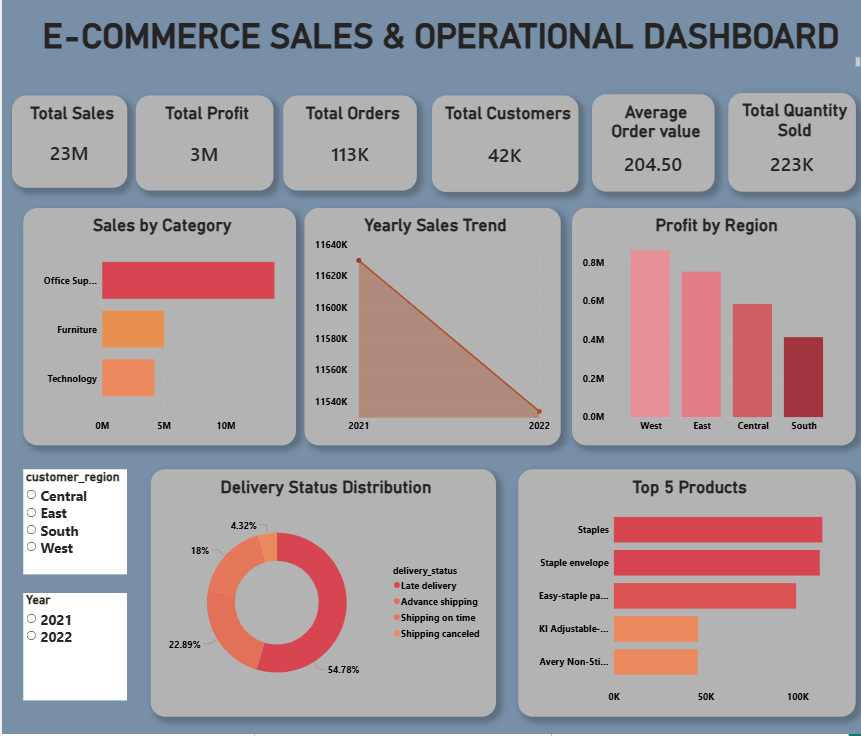
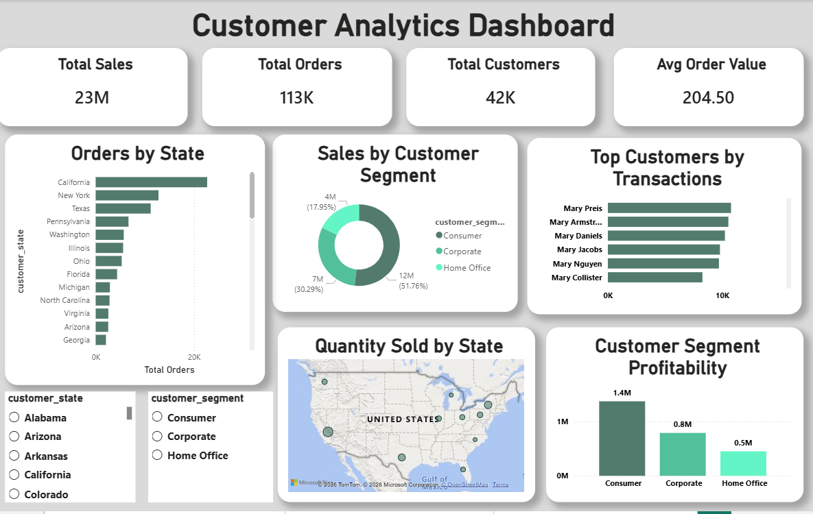
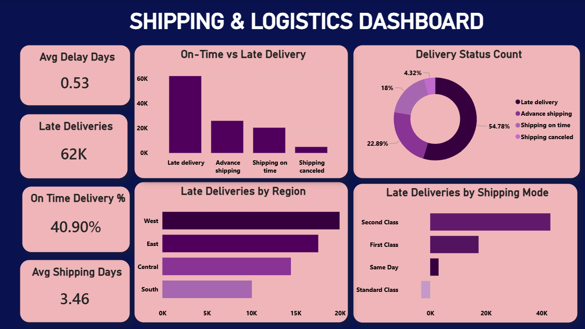

# E-Commerce Sales & Operations Dashboard

## Project Overview
This Power BI project analyzes e-commerce sales, customer behavior, profitability, and shipping performance.

## Dashboard Pages
1. Executive Sales Dashboard
2. Customer Analytics Dashboard
3. Shipping & Logistics Dashboard

## Tools Used
- Power BI
- Power Query
- DAX
- Data Visualization
- Business Intelligence

## Key KPIs
- Total Sales
- Total Profit
- Total Orders
- Total Customers
- Average Order Value
- On-Time Delivery %
- Average Shipping Days
- Late Deliveries

## Key Insights
- Office Supplies generated the highest sales.
- Consumer segment contributed the highest profit.
- West region had the highest late deliveries.
- Late delivery formed the largest delivery status category.
- Second Class shipping had the highest delivery volume.

## Skills Demonstrated
- Data Cleaning
- KPI Design
- DAX Measures
- Dashboard Design
- Customer Analytics
- Logistics Analytics
- Business Storytelling
E-Commerce Sales & Operations Dashboard

This dashboard includes:
• Executive Sales Analytics
• Customer Analytics
• Shipping & Logistics Insights
• KPI Tracking
• DAX Measures
• Interactive Visualizations

## Dashboard Preview

### Executive Sales Dashboard

### Customer Analytics Dashboard

### Shipping & Logistics Dashboard

## How to Use

1. Download the `Ecommerce_Sales_Operations_Dashboard.pbix` file
2. Open in Power BI Desktop
3. Refresh data if required
4. Explore interactive dashboard pages

## Author

Seema Metri  
Aspiring Data Analyst | Power BI | SQL | Excel | Python
